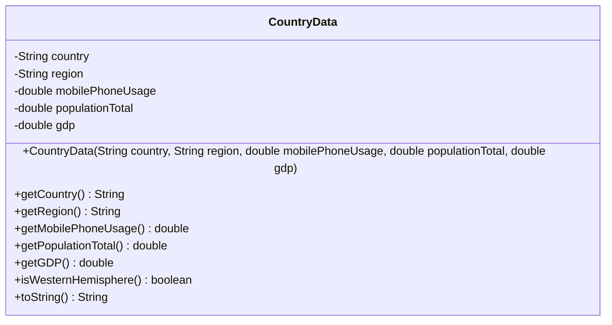

# UML Class Diagram - CountryData

## Visual Diagram

## Class Description

### CountryData

Represents country data from the World Indicators 2000 dataset.

**Attributes:**
- `-country: String` - The name of the country
- `-region: String` - The geographic region (Africa, Americas, Asia, Europe, Oceania)
- `-mobilePhoneUsage: double` - The mobile phone usage rate (as a decimal)
- `-populationTotal: double` - The total population of the country
- `-gdp: double` - The Gross Domestic Product of the country

**Methods:**
- `+CountryData(...)` - Constructor that initializes all attributes
- `+getCountry(): String` - Returns the country name
- `+getRegion(): String` - Returns the geographic region
- `+getMobilePhoneUsage(): double` - Returns the mobile phone usage rate
- `+getPopulationTotal(): double` - Returns the total population
- `+getGDP(): double` - Returns the GDP
- `+isWesternHemisphere(): boolean` - Returns true if in Western Hemisphere
- `+toString(): String` - Returns formatted string representation

**Visibility:**
- `-` (minus sign) = private
- `+` (plus sign) = public
